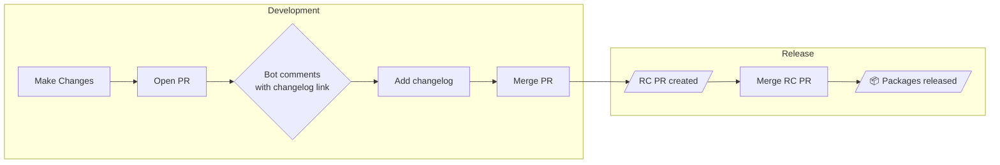

<p align="center">
  <picture>
    <source media="(prefers-color-scheme: dark)" srcset=".github/banner-dark.svg">
    <source media="(prefers-color-scheme: light)" srcset=".github/banner-light.svg">
    
  </picture>
</p>

<p align="center">
  Changelog management for Rust, Python, Go, and TypeScript¹ workspaces.
  <br>
  <sub>¹ TypeScript support is coming soon.</sub>
</p>

## Quick Start

```bash
# Install changelogs
curl -sSL changelogs.sh | sh

# Initialize changelogs in your workspace
changelogs init

# Add a changelog for your changes
changelogs add

# See what would be released
changelogs status

# Apply version bumps and generate changelogs
changelogs version
```

## Workflows



### Development

| # | Step | Description |
|:-:|:-----|:------------|
| 1 | Make changes & open PR | Implement your feature or fix |
| 2 | Bot comments on PR | Links to add/edit changelog (AI pre-fills if enabled) |
| 3 | Add changelog & merge | Changelog gets staged in `.changelog/` |

### Release

| # | Step | Description |
|:-:|:-----|:------------|
| 1 | Push to main | Triggers release workflow |
| 2 | RC PR created | Version bumps and changelog updates |
| 3 | Merge RC PR | Packages published, GitHub releases created |

## Installation

### Pre-built binaries (recommended)

```bash
curl -sSL https://changelogs.sh | sh
```

Or download directly from [GitHub Releases](https://github.com/wevm/changelogs/releases):

| Platform | Download |
|----------|----------|
| Linux (x86_64) | [changelogs-linux-amd64](https://github.com/wevm/changelogs/releases/latest/download/changelogs-linux-amd64) |
| macOS (Intel) | [changelogs-darwin-amd64](https://github.com/wevm/changelogs/releases/latest/download/changelogs-darwin-amd64) |
| macOS (Apple Silicon) | [changelogs-darwin-arm64](https://github.com/wevm/changelogs/releases/latest/download/changelogs-darwin-arm64) |

## Commands

| Command | Description |
|---------|-------------|
| `init` | Initialize `.changelog/` directory |
| `add` | Create a new changelog interactively |
| `add --ai "<command>"` | Generate changelog using AI (see [Supported AI Providers](#supported-ai-providers)) |
| `status` | Show pending changelogs and releases |
| `version` | Apply version bumps and update changelogs |
| `version --prerelease rc` | Apply prerelease bumps like `1.6.0-rc1`, then `1.6.0-rc2` |
| `publish` | Publish unpublished packages to crates.io |

## Configuration

`.changelog/config.toml`:

```toml
# How to bump packages that depend on changed packages
dependent_bump = "patch"  # patch, minor, or none

[changelog]
format = "per-crate"  # or "root"

# Fixed groups: all always share the same version
[[fixed]]
members = ["crate-a", "crate-b"]

# Linked groups: versions sync when released together  
[[linked]]
members = ["sdk-core", "sdk-macros"]

# Packages to ignore
ignore = []
```

## Changelog Format

`.changelog/brave-lions-dance.md`:

```markdown
---
my-crate: minor
other-crate: patch
---

Added new feature X that does Y.

Fixed bug Z in the parser.
```

## Custom AI Instructions

Override the default AI prompt by placing an `instructions.md` file in your `.changelog/` directory:

`.changelog/instructions.md`:

The file contents are used as the prompt template. Use `{packages}` and `{diff}` as placeholders:

```markdown
Generate a changelog entry for this diff.

Available packages: {packages}

---
<package-name>: patch
---

Description.

Version rules:
- "major": any removal or rename of public API
- "minor": new features
- "patch": bug fixes, internal changes

{diff}
```

Priority: `--instructions` flag > `.changelog/instructions.md` > built-in default.

## Supported AI Providers

The `--ai` flag and GitHub Action `ai` input accept any CLI command that reads from stdin and outputs text. The diff is piped to the command, and the output becomes the changelog entry.

| Provider | Command | Required Secret | Install |
|----------|---------|-----------------|---------|
| Amp | `amp -x` | `AMP_API_KEY` | `npm install -g @sourcegraph/amp` |
| Claude Code | `claude -p` | `ANTHROPIC_API_KEY` | `npm install -g @anthropic-ai/claude-code` |
| OpenAI | `openai api chat.completions.create -m gpt-4o` | `OPENAI_API_KEY` | `pip install openai` |
| Gemini | `gemini` | `GOOGLE_API_KEY` | `npm install -g @anthropic-ai/gemini-cli` |


### Examples

```bash
# Using Amp
changelogs add --ai "amp -x"

# Using Claude
changelogs add --ai "claude -p"

```

## GitHub Actions

### Check Changelogs on PRs

Comments on PRs with changelog status. If no changelog exists and `ai` is provided, generates one and pre-fills the "Add changelog" link.

```yaml
name: Changelog

on:
  pull_request:
    types: [opened, synchronize]

jobs:
  changelog:
    runs-on: ubuntu-latest
    permissions:
      contents: write
    steps:
      - uses: actions/checkout@v4

      - run: npm install -g @sourcegraph/amp

      - uses: wevm/changelogs/check@master
        with:
          ai: 'amp -x'
        env:
          AMP_API_KEY: ${{ secrets.AMP_API_KEY }}
```

### Create RC PR or Release

Creates a release candidate PR when changelogs exist, or publishes packages when the RC PR is merged.

```yaml
name: Release

on:
  push:
    branches:
      - main
      - 'release/**'

jobs:
  release:
    runs-on: ubuntu-latest
    steps:
      - uses: actions/checkout@v4
      - uses: wevm/changelogs@master
        env:
          GITHUB_TOKEN: ${{ secrets.GITHUB_TOKEN }}
```

**The release action automatically handles both versioning and publishing:**

1. **If changelogs exist** → Creates/updates a "Version Packages" PR
2. **If no changelogs** (PR was just merged) → Publishes unpublished packages to crates.io

### Post-Version Command

Use `post-version-command` to run a command after version bumps but before the PR is created (e.g. refreshing lockfiles):

```yaml
- uses: wevm/changelogs@master
  with:
    post-version-command: 'cargo metadata --format-version=1 > /dev/null'
```

### Prerelease Versioning

Use `prerelease` to create release candidate PRs before a stable release:

```yaml
- uses: wevm/changelogs@master
  with:
    prerelease: rc
```

This runs `changelogs version --prerelease rc`, creating versions like
`1.6.0-rc1` and incrementing an existing `1.6.0-rc1` to `1.6.0-rc2`.
Running `changelogs version` without `--prerelease` promotes an existing
prerelease version to its stable version, such as `1.6.0`.

In the GitHub Action, leave `prerelease` unset for the stable release workflow.
When there are no pending changelog files but package versions are still
prereleases, the action opens a stable-promotion PR instead of publishing
immediately.

### Action Inputs

| Input | Description | Default |
|-------|-------------|---------|
| `branch` | Branch name for the version PR. Defaults to `changelog-release/{trigger-branch}`, enabling independent release PRs per branch. | `changelog-release/{trigger-branch}` |
| `commit` | Commit message for version bump | `Version Packages` |
| `conventional-commit` | Use conventional commit format | `false` |
| `prerelease` | Prerelease identifier for release candidates, such as `rc` | - |
| `post-version-command` | Command to run after version bumps but before PR creation | - |
| `crate-token` | Crates.io API token for publishing (Rust) | - |
| `pypi-token` | PyPI API token for publishing (Python) | - |

### Multi-branch releases

To maintain independent release trains per branch (e.g. patch releases on
`release/v1.5` alongside new features on `master`), configure your release
workflow to run on each release branch. The action then automatically creates a
separate release PR per trigger branch:

| Trigger branch  | Release PR branch                  |
|-----------------|------------------------------------|
| master          | changelog-release/master           |
| release/v1.5    | changelog-release/release/v1.5     |
| release/v2.0    | changelog-release/release/v2.0     |

Changelog entries on each branch are independent. To override the release PR
branch name, set the `branch` input explicitly:

```yaml
- uses: wevm/changelogs@master
  with:
    branch: my-custom-release-branch
```

### Action Outputs

| Output | Description |
|--------|-------------|
| `hasChangelogs` | Whether there are pending changelogs |
| `pullRequestNumber` | The PR number if created/updated |
| `published` | Whether packages were published |
| `publishedPackages` | JSON array of published packages |

## Ecosystem Notes

### Python

Changelogs supports Python packages using PEP 621 `pyproject.toml` files.

**Requirements:**
- `pyproject.toml` with `[project]` section containing `name` and `version`
- Static version (dynamic versions not supported)
- Semantic versioning (no PEP 440 epochs or local versions)
- `python -m build` and `twine` installed (`pip install build twine`)

**Limitations:**
- Single-package repos only (no Python monorepo support)
- PEP 621 only (no `setup.py` or `setup.cfg`)

**Authentication:**

You can authenticate to PyPI with either a static API token or [Trusted
Publishing](https://docs.pypi.org/trusted-publishers/) (OIDC). The action picks
OIDC automatically when `pypi-token` is empty and the workflow has
`id-token: write`. PyPI auth setup only runs when `ecosystem: python` is set, so
include that input for both static-token and Trusted Publishing workflows.

Static API token:

```yaml
- uses: wevm/changelogs@master
  with:
    ecosystem: python
    pypi-token: ${{ secrets.PYPI_API_TOKEN }}
```

Trusted Publishing (recommended — no long-lived secrets):

```yaml
jobs:
  release:
    runs-on: ubuntu-latest
    environment: release
    permissions:
      contents: write
      pull-requests: write
      id-token: write   # required for OIDC trusted publishing
    steps:
      - uses: actions/checkout@v5
        with:
          persist-credentials: true
      - uses: wevm/changelogs@master
        with:
          ecosystem: python
        env:
          GITHUB_TOKEN: ${{ secrets.GITHUB_TOKEN }}
```

You also need to register a Trusted Publisher on PyPI under the project's
**Publishing** settings. The repository, workflow filename, and (optionally)
environment must match the workflow above.

### Go

Changelogs supports Go modules using `go.mod` files. Go is unusual: versions
live in **git tags**, not in the manifest. To remember the bumped version
between the `version` and `publish` CI runs, changelogs writes it inline as a
comment in `go.mod`:

```go
// changelogs:version 1.2.3
module github.com/owner/repo
```

**Requirements:**
- `go.mod` at the repository root with a `module` directive
- Semantic versioning for git tags (`v1.2.3`)

**Package name:** Go uses the **full module path** as the package name (e.g.
`github.com/owner/repo`). This is what you write in changelog frontmatter:

```markdown
---
github.com/owner/repo: minor
---
```

**Publishing:**
- No registry token required — pushing the git tag publishes to `proxy.golang.org`
- Tag format is `vX.Y.Z` (no package-name prefix)
- Already-published versions are skipped via a `proxy.golang.org/<module>/@v/v<ver>.info` lookup

**Limitations:**
- Single-module repos only (no Go monorepo / multi-`go.mod` support)
- Major version bumps (≥ v2) do not currently rewrite the `module .../vN` suffix

### SwiftPM

Changelogs supports Swift Package Manager packages using root `Package.swift`
files. SwiftPM versions live in **git tags**, not in the manifest. To remember
the bumped version between the `version` and `publish` CI runs, changelogs writes
it inline as a comment in `Package.swift`:

```swift
// swift-tools-version: 5.10
// changelogs:version 1.2.3
import PackageDescription
```

**Requirements:**
- `Package.swift` at the repository root with `Package(name: "...")`
- Semantic versioning for git tags (`v1.2.3`)

**Package name:** Swift uses the package's `Package(name:)` value as the package
name. This is what you write in changelog frontmatter:

```markdown
---
TempoKit: minor
---
```

**Publishing:**
- No registry token required — pushing the git tag publishes the SwiftPM package
- Tag format is `vX.Y.Z` (no package-name prefix)

**Limitations:**
- Single-package repos only (no Swift package monorepo support)
- Dependency version updates currently support `.package(url: ..., from: "...")`
  and `.package(url: ..., exact: "...")`

## License

MIT OR Apache-2.0
